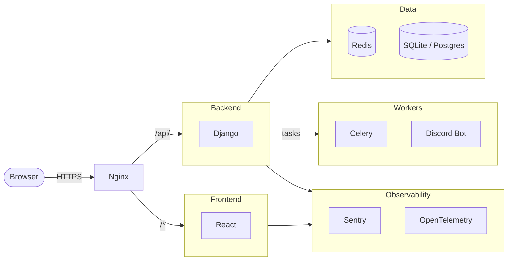

# Draftforge

A tournament management platform for Dota 2 gaming communities.

**Website:** [dota.kettle.sh](https://dota.kettle.sh)

**Documentation:** [kettleofketchup.github.io/DraftForge](https://kettleofketchup.github.io/DraftForge/)

## Table of Contents

- [Features](#features)
- [Tech Stack](#tech-stack)
- [Quick Start](#quick-start)
- [Screenshots](#screenshots)
- [Demo Videos](#demo-videos)
- [Development](#development)

## Features

| Status | Feature | Description |
|:------:|---------|-------------|
| :white_check_mark: | [Tournament Brackets](https://kettleofketchup.github.io/DraftForge/features/bracket/) | Single/double elimination and round-robin with automatic bracket generation |
| :white_check_mark: | [Team Draft System](https://kettleofketchup.github.io/DraftForge/features/draft/) | Snake, Normal, and Shuffle draft modes balanced by MMR for 40+ player drafts |
| :white_check_mark: | [Hero Draft](https://kettleofketchup.github.io/DraftForge/features/herodraft/) | Real-time Captains Mode hero picking with spectator view, timers, and pick/ban tracking |
| :white_check_mark: | Match Tracking | Steam API integration for match statistics |
| :white_check_mark: | [Telemetry](https://kettleofketchup.github.io/DraftForge/dev/telemetry/) | Structured logging with structlog and optional OpenTelemetry tracing |
| :test_tube: | [CSV Import](https://kettleofketchup.github.io/DraftForge/features/planned/csv-import/) | Bulk-add users via CSV upload with conflict detection and team assignment |
| :soon: | [Team Management](https://kettleofketchup.github.io/DraftForge/features/planned/team-management/) | Create and manage rosters, track player stats, and coordinate with Discord |
| :soon: | [League System](https://kettleofketchup.github.io/DraftForge/features/planned/league-rating/) | Season-based competitive leagues with ELO ratings and standings |
| :soon: | [Discord Integration](https://kettleofketchup.github.io/DraftForge/features/planned/discord-integration/) | Server syncing for rosters and tournament announcements |
| :soon: | [Auction Draft](https://kettleofketchup.github.io/DraftForge/features/planned/auction-house/) | Captain nomination bidding with salary caps and real-time WebSocket auctions |

## Tech Stack

| Layer | Technologies |
|-------|--------------|
| Frontend | React 19, TypeScript, Vite, TailwindCSS, Radix UI |
| Backend | Django 5, Django REST Framework, Daphne (WebSockets), Celery (distributed task workers) |
| Infrastructure | Docker, Nginx, Redis (caching) |
| Observability | Sentry (error tracking & session replay), structlog, OpenTelemetry (opt-in) |
| Auth | Discord OAuth, authenticated WebSockets |



## Quick Start

**Run everything locally with populated test data:**

```bash
git clone https://github.com/kettleofketchup/draftforge.git
cd draftforge
./dev              # Install just, create venv, install deps
poetry install     # Install Python dependencies
just test::setup   # Build images, migrate, populate test data, start stack
```

Open `https://localhost` when ready.

## Screenshots

| Home | Tournaments | Tournament Detail | Bracket |
|------|-------------|-------------------|---------|
|  |  |  |  |

## Demo Videos

Automated demo recordings are available for key features:

| Captain 1 - HeroDraft | Captain 2 - HeroDraft |
|-----------------------|-----------------------|
|  |  |
| [Full Video](docs/assets/videos/captain1_herodraft.webm) | [Full Video](docs/assets/videos/captain2_herodraft.webm) |

| Shuffle Draft | Snake Draft |
|---------------|-------------|
|  |  |
| [Full Video](docs/assets/videos/shuffle_draft.webm) | [Full Video](docs/assets/videos/snake_draft.webm) |

### Generate Demos Locally

```bash
source .venv/bin/activate

# Record all demos and generate GIFs
inv demo.quick

# Or record individually
inv demo.shuffle     # Shuffle draft
inv demo.snake       # Snake draft
inv demo.herodraft   # Hero draft with bracket
```

Full videos: `docs/assets/videos/` | GIF previews: `docs/assets/gifs/`

## Development

Full development documentation is available at [kettleofketchup.github.io/DraftForge](https://kettleofketchup.github.io/DraftForge/), including:

- [Installation Guide](https://kettleofketchup.github.io/DraftForge/getting-started/installation/)
- [Quick Start](https://kettleofketchup.github.io/DraftForge/getting-started/quick-start/)
- [Architecture Overview](https://kettleofketchup.github.io/DraftForge/architecture/overview/)
- [API Reference](https://kettleofketchup.github.io/DraftForge/api/endpoints/)
- [Draft System](https://kettleofketchup.github.io/DraftForge/features/draft/)
- [Hero Draft](https://kettleofketchup.github.io/DraftForge/features/herodraft/)
- [Telemetry](https://kettleofketchup.github.io/DraftForge/dev/telemetry/)
