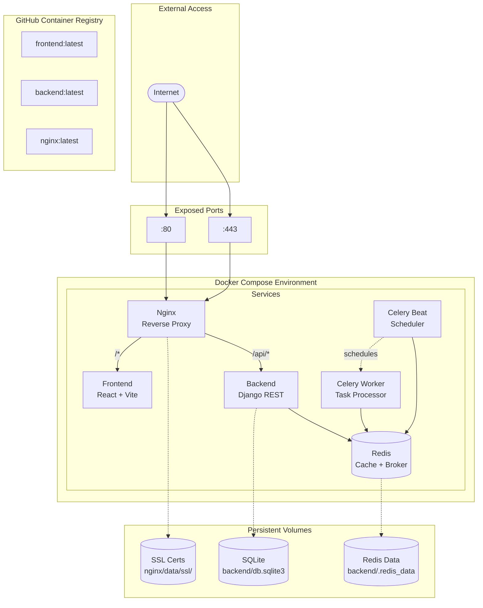
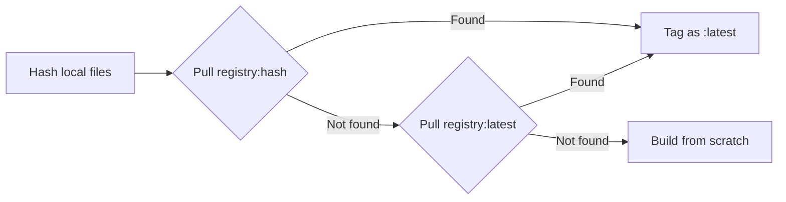

# Docker Architecture

## Overview



## Docker Compose Configurations

The project provides multiple Docker Compose configurations for different environments:

| File | Purpose | Use Case |
|------|---------|----------|
| `docker-compose.debug.yaml` | Development | Local development with hot reload |
| `docker-compose.test.yaml` | Testing | Cypress E2E testing |
| `docker-compose.prod.yaml` | Production | Production deployment |
| `docker-compose.release.yaml` | Release | Versioned release deployment |

## Services

### Frontend Service

```yaml
frontend:
  image: ghcr.io/kettleofketchup/draftforge/frontend:latest
  # Development: mounts ./frontend/ for hot reload
  volumes:
    - ./frontend/:/app
```

- **Dev Image**: `frontend-dev:latest` - Includes dev dependencies
- **Prod Image**: `frontend:latest` - Optimized production build

### Backend Service

```yaml
backend:
  image: ghcr.io/kettleofketchup/draftforge/backend:latest
  depends_on:
    - redis
  volumes:
    - ./backend/:/app/backend
```

- **Dev Image**: `backend-dev:latest` - Debug mode enabled
- **Prod Image**: `backend:latest` - Production optimized

### Redis Service

```yaml
redis:
  image: redis:8.2.1-alpine
  volumes:
    - ./backend/.redis_data:/data
```

Persistent data storage for cache across restarts.

### Nginx Service

```yaml
nginx:
  image: ghcr.io/kettleofketchup/draftforge/nginx:latest
  ports:
    - "80:80"
    - "443:443"
  volumes:
    - ./nginx/default.template.conf:/etc/nginx/templates/
    - ./nginx/data/ssl/:/etc/letsencrypt/live/dota.kettle.sh/
```

### Celery Worker Service

```yaml
celery-worker:
  image: ghcr.io/kettleofketchup/draftforge/backend:latest
  command: celery -A config worker -l info
  depends_on:
    - redis
    - backend
```

Processes background tasks from the Redis queue. Uses the same image as the backend service.

### Celery Beat Service

```yaml
celery-beat:
  image: ghcr.io/kettleofketchup/draftforge/backend:latest
  command: celery -A config beat -l info
  depends_on:
    - redis
    - celery-worker
```

Scheduler that triggers periodic tasks (e.g., league match sync every 60 seconds).

## Environment Files

| File | Description |
|------|-------------|
| `docker/.env.dev` | Development environment variables |
| `docker/.env.test` | Test environment variables |
| `docker/.env.prod` | Production environment variables |
| `docker/.env.release` | Release version and settings |

### Environment Variables

| Variable | Description | Default |
|----------|-------------|---------|
| `NODE_ENV` | Environment mode (dev/test/prod/release) | - |
| `DOMAIN` | Site domain | `localhost` |
| `FRONTEND_HOST` | Frontend host | `localhost` |
| `FRONTEND_PORT` | Frontend port | `3000` |
| `BACKEND_HOST` | Backend host | `localhost` |
| `BACKEND_PORT` | Backend port | `8000` |
| `SSR_API_URL` | Backend URL for SSR requests | `http://backend:8000/api` |

### SSR_API_URL

The frontend uses Server-Side Rendering (SSR). During SSR, the Node.js server needs to reach the backend API. Since it runs inside Docker, it uses the Docker service name.

```bash
# Default - uses Docker Compose service name
SSR_API_URL=http://backend:8000/api

# Kubernetes example
SSR_API_URL=http://backend-service:8000/api

# External backend
SSR_API_URL=https://api.example.com/api
```

!!! info "Why not /api?"
    On the client (browser), requests to `/api` are proxied by Nginx. But during SSR, the Node.js server makes requests directly - it needs the full internal URL to reach the backend container.

## Image Registry

All images are hosted on GitHub Container Registry:

```
ghcr.io/kettleofketchup/draftforge/
├── frontend:latest
├── frontend-dev:latest
├── backend:latest
├── backend-dev:latest
└── nginx:latest
```

## Content-Hash Tagging

Docker images are tagged with a SHA256 hash of the files that determine their installed dependencies. This detects stale images — if a dependency changes (e.g. a new npm package), the hash changes, and pulls/builds know to update.

### What Gets Hashed

| Service | Files | Script |
|---------|-------|--------|
| **frontend** / **frontend-dev** | `frontend/Dockerfile`, `frontend/package-lock.json` | `scripts/hash-docker-image.sh frontend` |
| **backend** / **backend-dev** | `backend/Dockerfile`, `poetry.lock` | `scripts/hash-docker-image.sh backend` |
| **nginx** | `nginx/Dockerfile`, `nginx/entrypoint.sh`, `nginx/default.template.conf` | `scripts/hash-docker-image.sh nginx` |

Source code is **not** hashed — it's mounted at runtime, not baked into the image.

### How It Works



1. **Hash** — `sha256sum` of dependency files → content hash
2. **Pull** — try `image:hash` first (exact match), fall back to `image:latest`
3. **Build** — tags image with `:hash` and `:latest`
4. **Push** — pushes `:hash` and `:latest` tags

Docker Compose files reference `:latest` — the pull step handles tagging the correct image as `:latest`.

### Dev vs Release Tagging

| Operation | Tags | Use Case |
|-----------|------|----------|
| `just docker::all-build` | `:hash` + `:latest` | Development builds |
| `just docker::all-push` | `:hash` + `:latest` | Push to registry (CI) |
| `just docker::release::push` | `:version` + `:hash` + `:latest` | Production releases |

### Commands

```bash
# Inspect current hashes
just docker::hash              # All services
just docker::hash frontend     # Single service (full hash)

# Build with hash tags
just docker::all-build

# Pull by hash (falls back to latest)
just docker::all-pull

# Push hash + latest tags
just docker::all-push

# Release: includes version tags
just docker::release::push
```

### CI Integration

Two workflows use hash tagging:

- **`build-docker-images.yml`** — Triggers on push to `main` when Dockerfiles or lock files change. Builds and pushes hash-tagged images.
- **`playwright.yml`** — Pulls images by hash before running tests. Falls back to building if no image matches.

## Common Docker Operations

```bash
# Build all images
just docker::all-build

# Push to registry
just docker::all-push

# Pull latest images
just docker::all-pull

# Start development
just dev::debug

# Start production locally
just dev::local-prod
```

## Networking

### Development Network
Services communicate via Docker's default bridge network.

### Test Network
Creates an isolated `test-network` for E2E testing:

```yaml
networks:
  test-network:
    driver: bridge
```

## Volume Mounts

### Development Volumes
- Source code mounted for hot reload
- Database files persisted locally

### Production Volumes
- Only database and SSL certificates mounted
- No source code access

## SSL Certificates

Development uses self-signed certificates in `nginx/data/ssl/`.

Production uses Let's Encrypt via Certbot:
```bash
just prod::certbot
```
