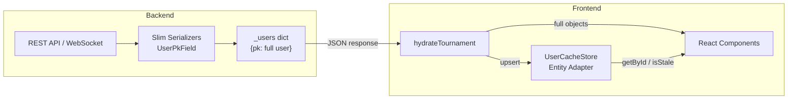
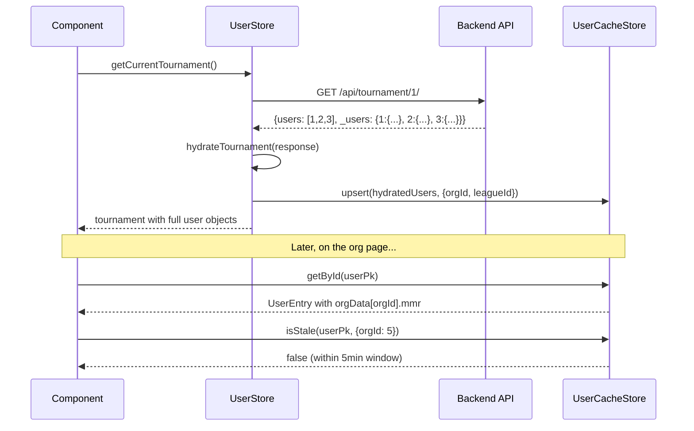

# User Entity Cache

The user entity cache is a normalized caching layer that separates **core user identity** from **context-scoped data** (org MMR, league MMR). It solves the problem of the same user appearing across multiple orgs, leagues, and tournaments with different MMR values in each context.

## Problem

A single user can belong to multiple organizations and leagues, each with a different MMR. Without normalization, user data is duplicated across every tournament, team, and draft response — inflating payloads and causing stale data when one copy is updated but others are not.

## Architecture Overview



The pattern has three layers:

1. **Backend slim serializers** — replace full user objects with integer PKs, plus a deduplicated `_users` sidecar dict
2. **Frontend hydration** — resolves PK references back to full user objects for component consumption
3. **Entity cache** — normalized Zustand store with org/league-scoped MMR and staleness tracking

---

## Backend: Slim Serializers

### UserPkField

A custom DRF field that serializes user relationships as just their `pk`:

```python
# backend/app/serializers.py
class UserPkField(serializers.RelatedField):
    def to_representation(self, value):
        if value is None:
            return None
        return value.pk
```

### Slim Serializer Variants

Each serializer that includes user references has a `Slim` variant:

```python
class TeamSerializerSlim(TeamSerializerForTournament):
    """User fields as pk-only integers."""
    members = UserPkField(many=True, read_only=True)
    captain = UserPkField()
    deputy_captain = UserPkField()
    dropin_members = UserPkField(many=True, read_only=True)
    left_members = UserPkField(many=True, read_only=True)
```

Similarly for `DraftSerializerSlim`, `DraftRoundSerializerSlim`, and `TournamentSerializerBase`.

### The `_users` Sidecar Dict

Full user data is collected once and attached as `_users` on the response:

```python
def _build_users_dict(tournament):
    """Build a deduplicated {pk: serialized_user} dict for a tournament."""
    seen_pks = _collect_tournament_user_pks(tournament)
    user_qs = CustomUser.objects.filter(pk__in=seen_pks).select_related("positions")
    return {u["pk"]: u for u in _serialize_users_with_mmr(user_qs, tournament)}
```

This is injected in views, consumers, and broadcast functions:

```python
data = TournamentSerializerSlim(tournament).data
data["_users"] = _build_users_dict(tournament)
```

### Resulting API Shape

```json
{
  "pk": 1,
  "name": "Weekly Tournament",
  "users": [101, 102, 103],
  "teams": [
    {
      "pk": 10,
      "captain": 101,
      "members": [101, 102],
      "deputy_captain": null
    }
  ],
  "_users": {
    "101": {
      "pk": 101, "username": "alice", "mmr": 2500,
      "orgUserPk": 50, "league_mmr": 2400
    },
    "102": {
      "pk": 102, "username": "bob", "mmr": 2800,
      "orgUserPk": 51, "league_mmr": 2700
    },
    "103": {
      "pk": 103, "username": "charlie", "mmr": 3000,
      "orgUserPk": 52, "league_mmr": 2900
    }
  }
}
```

Each user appears exactly once in `_users`, regardless of how many teams/rounds reference them.

### Org-Scoped MMR Serialization

When a tournament belongs to a league (and therefore an org), users are serialized with org-scoped MMR via `OrgUserSerializer`:

```python
def _serialize_users_with_mmr(users_qs, tournament):
    league = tournament.league if tournament else None
    org = league.organization if league else None
    if not org:
        return TournamentUserSerializer(users_qs, many=True).data

    org_users = OrgUser.objects.filter(
        user__in=users_qs, organization=org
    ).select_related("user", "user__positions")

    return OrgUserSerializer(
        org_users, many=True, context={"league_id": league.pk}
    ).data
```

The `OrgUserSerializer` includes:

- `pk` — the `CustomUser.pk` (user identity)
- `orgUserPk` — the `OrgUser.pk` (needed for org-scoped PATCH)
- `mmr` — org-scoped MMR from `OrgUser.mmr`
- `league_mmr` — league-scoped MMR snapshot from `LeagueUser.mmr`

---

## Frontend: Hydration

### `hydrateTournament()`

Resolves PK-only references back to full user objects so components don't need to change:

```typescript
// frontend/app/lib/hydrateTournament.ts
export function hydrateTournament(
  raw: TournamentType & { _users?: Record<number, unknown> },
): TournamentType {
  const map = raw._users as UsersMap | undefined;
  if (!map) return raw;

  return {
    ...raw,
    users: resolveArray(raw.users, map),
    captains: resolveArray(raw.captains, map),
    teams: raw.teams?.map((t) => hydrateTeam(t, map)),
    games: raw.games?.map((g) => /* hydrate teams in game */),
    draft: raw.draft ? hydrateDraftFields(raw.draft, map) : raw.draft,
  } as TournamentType;
}
```

The `resolve()` function handles mixed data — if a reference is already an object it passes through, if it's a number it looks up the `_users` map:

```typescript
function resolve(ref: unknown, map: UsersMap): unknown {
  if (ref == null) return ref;
  if (typeof ref === 'number') return map[ref] ?? { pk: ref };
  return ref;
}
```

A companion `hydrateDraft()` function handles standalone draft responses.

---

## Frontend: Entity Cache

### Entity Adapter

A generic, reusable adapter for any entity type with a `pk: number` field:

```typescript
// frontend/app/lib/entityAdapter.ts
interface EntityState<T> {
  entities: Record<number, T>;
  indexes: Record<string, Record<string | number, number>>;
}
```

Key features:

- **Schema-driven change detection** — only checks fields defined in the Zod schema
- **Lazy allocation** — `upsertMany()` only spreads state when a change is detected
- **Reference preservation** — unchanged entities keep their object identity (prevents React re-renders)
- **Secondary indexes** — fast O(1) lookups by Discord ID, Steam Account ID, etc.

```typescript
const adapter = createEntityAdapter<UserEntry>({
  schema: CoreUserSchema,
  indexes: [
    { name: 'byDiscordId', key: 'discordId' },
    { name: 'bySteamAccountId', key: 'steam_account_id' },
  ],
});
```

### UserEntry Type

Separates core identity from context-scoped data:

```typescript
// frontend/app/store/userCacheTypes.ts
interface UserEntry {
  // Core identity (stable across all contexts)
  pk: number;
  username: string;
  avatar?: string | null;
  nickname?: string | null;
  steam_account_id?: number | null;
  discordId?: string | null;
  // ... other core fields

  // Context-scoped data (keyed by org/league id)
  orgData: Record<number, OrgUserData>;
  leagueData: Record<number, LeagueUserData>;

  // Staleness tracking
  _fetchedAt: number;
}

interface OrgUserData {
  id: number;       // OrgUser.pk (for PATCH operations)
  mmr: number;      // Org-scoped MMR
  _fetchedAt: number;
}

interface LeagueUserData {
  id: number;       // LeagueUser.pk
  mmr: number;      // League-scoped MMR snapshot
  _fetchedAt: number;
}
```

### UserCacheStore

A Zustand store built on the entity adapter with custom scoped-data handling:

```typescript
// frontend/app/store/userCacheStore.ts
export const useUserCacheStore = create<UserCacheState>()(
  devtools((set, get) => ({
    ...userAdapter.getInitialState(),
    staleAfterMs: 5 * 60 * 1000, // 5 minutes

    upsert(incoming, context) { /* ... */ },
    remove(pk) { /* ... */ },
    getById(pk) { return get().entities[pk]; },
    getByDiscordId(discordId) { /* index lookup */ },
    getBySteamAccountId(id) { /* index lookup */ },
    isStale(pk, context) { /* checks core + scoped staleness */ },
    reset() { /* clears all entries */ },
  }))
);
```

!!! warning "Custom Upsert Logic"
    The store's `upsert()` method **bypasses** `adapter.upsertMany()` because the adapter only checks core keys for changes. Org/league MMR updates would be silently dropped. Instead, `upsert()` uses a custom `hasScopedChanged()` function that checks both core fields and scoped data.

### UpsertContext

When upserting users, a context object tells the cache which scoped data is being provided:

```typescript
interface UpsertContext {
  orgId?: number;
  leagueId?: number;
}

// Example: upserting users from an org page
useUserCacheStore.getState().upsert(users, { orgId: 5 });

// Example: upserting users from a league page
useUserCacheStore.getState().upsert(users, { orgId: 5, leagueId: 3 });
```

### Staleness Tracking

Each entry tracks when its data was fetched. Both core and scoped data have independent timestamps:

```typescript
isStale(pk, context) {
  const entry = get().entities[pk];
  if (!entry) return true;

  const now = Date.now();
  const staleMs = get().staleAfterMs;

  // Core data stale?
  if (now - entry._fetchedAt > staleMs) return true;

  // Org-scoped data stale?
  if (context?.orgId) {
    const orgEntry = entry.orgData[context.orgId];
    if (!orgEntry || now - orgEntry._fetchedAt > staleMs) return true;
  }

  // League-scoped data stale?
  if (context?.leagueId) {
    const leagueEntry = entry.leagueData[context.leagueId];
    if (!leagueEntry || now - leagueEntry._fetchedAt > staleMs) return true;
  }

  return false;
}
```

### Zod Schemas

Two schemas define the canonical user shape:

```typescript
// frontend/app/components/user/schemas.ts

// Full schema — includes context-scoped fields from API responses
const UserSchema = z.object({
  pk: z.number().min(0).optional(),
  username: z.string().min(2).max(100),
  mmr: z.number().min(0).nullable().optional(),         // Org MMR
  league_mmr: z.number().min(0).nullable().optional(),  // League MMR
  orgUserPk: z.number().min(0).optional(),              // OrgUser.pk
  // ... other fields
});

// Core schema — omits context-scoped fields; used for change detection
const CoreUserSchema = UserSchema.omit({
  orgUserPk: true,
  mmr: true,
  league_mmr: true,
}).extend({ pk: z.number() }); // pk required in cache
```

The entity adapter uses `CoreUserSchema` to determine which fields to compare — context-scoped fields (`mmr`, `league_mmr`, `orgUserPk`) are handled separately in `orgData`/`leagueData`.

---

## Data Flow



---

## File Reference

### Backend

| File | Purpose |
|------|---------|
| `backend/app/serializers.py` | `UserPkField`, slim serializers, `_build_users_dict()` |
| `backend/org/serializers.py` | `OrgUserSerializer` (org-scoped MMR + `orgUserPk`) |
| `backend/league/serializers.py` | `LeagueUserSerializer` (league-scoped MMR) |
| `backend/app/views_main.py` | Injects `_users` dict on tournament/draft GET responses |
| `backend/app/consumers.py` | Injects `_users` dict on WebSocket draft state |
| `backend/app/broadcast.py` | Injects `_users` dict on broadcast events |

### Frontend

| File | Purpose |
|------|---------|
| `frontend/app/lib/entityAdapter.ts` | Generic entity adapter (schema-driven, indexed) |
| `frontend/app/lib/entityAdapter.test.ts` | Unit tests for the adapter |
| `frontend/app/lib/hydrateTournament.ts` | Resolves PK references using `_users` dict |
| `frontend/app/store/userCacheStore.ts` | Zustand store with scoped upsert and staleness |
| `frontend/app/store/userCacheTypes.ts` | `UserEntry`, `OrgUserData`, `LeagueUserData`, `UpsertContext` |
| `frontend/app/components/user/schemas.ts` | `UserSchema`, `CoreUserSchema` (Zod) |
