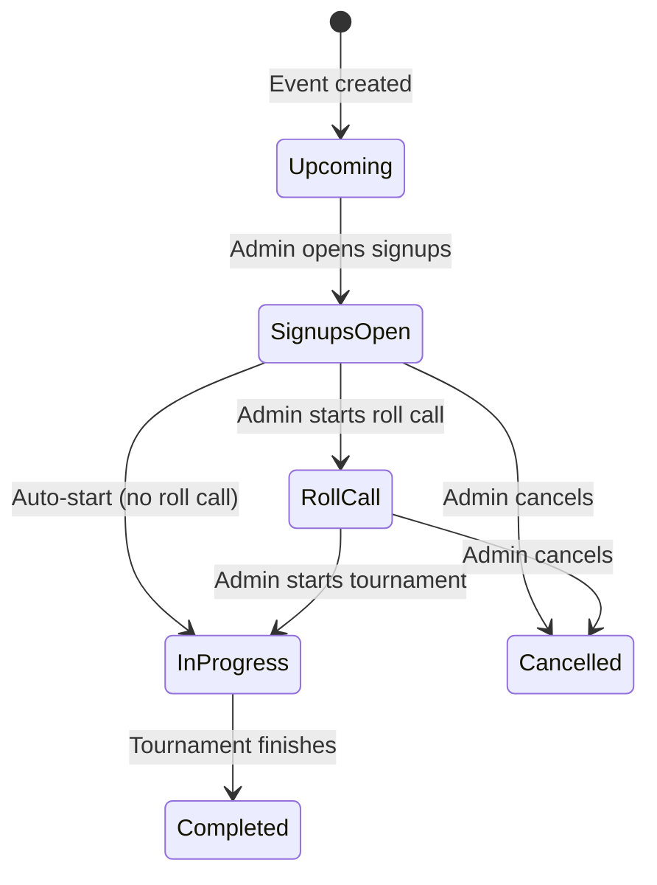

# Roll Call & Signups

Manage player attendance with RSVP confirmations, waitlists, and a dedicated roll call page before tournaments start.

## Overview

The roll call system ensures the right players are confirmed before a tournament begins. Admins freeze signups, review attendance on a dedicated page, and start the tournament with the confirmed roster.

<figure markdown="span">
  { width="500" }
  <figcaption>20-player roll call: confirming attendance and starting a tournament</figcaption>
</figure>

[:material-play-circle: Watch roll call demo](https://assets.kettle.sh/draftforge/videos/roll_call.webm)

---

## Flow

### 1. Signups Open

Players RSVP from the event page. Each signup shows:

- **Position number** (#1, #2, ...) — first-come-first-served
- **Status badge** — RSVP, Pending Approval, Approved, Confirmed, Waitlisted
- **UserStrip** — avatar, name, positions, MMR badges

Admin actions per signup: Approve, Reject, Confirm.

### 2. Start Roll Call

Admin clicks "Start Roll Call" on the event page. A confirmation dialog appears:

> "Freeze signups and begin roll call? Players will need to be confirmed before the tournament can start."

After confirming, the browser navigates to `/rollcall/:eventId`.

### 3. Roll Call Page

The dedicated roll call page (`/rollcall/:eventId`) shows:

- **Header** with back button, event name, state badge
- **Summary badges** — "X confirmed / Y needed" and "Z awaiting"
- **Confirmed section** — players who confirmed (with Remove button)
- **Awaiting Confirmation section** — approved players (with Confirm + Reject buttons)
- **Other section** — any remaining signups

### 4. Start Tournament

When enough players are confirmed (meets `min_players` threshold), the "Start Tournament" button enables. A confirmation dialog shows:

> "Start the tournament with X confirmed players?"

After confirming, the tournament is created with the confirmed roster and the browser navigates back to the event page.

---

## Waitlist

When an event reaches `max_players`, new RSVPs go to the waitlist:

- **Position tracking** — each waitlisted player gets a queue position
- **Automatic promotion** — when someone cancels or is rejected, the next waitlisted player is promoted
- **Waitlist tab** — always visible on the event page with count, even when empty

---

## RSVP Behavior

| Action | Result |
|--------|--------|
| RSVP (first time) | Creates signup with status based on event config |
| RSVP (already signed up) | Error toast: "User has already signed up" |
| Cancel RSVP | Sets status to cancelled, opens slot for waitlist |
| RSVP after cancel | Deletes old signup, creates fresh one |
| RSVP when full | Added to waitlist with position number |

---

## Configuration

These event config fields control signup behavior:

| Field | Default | Description |
|-------|---------|-------------|
| `auto_approve` | false | Auto-approve signups (skip pending state) |
| `auto_confirm` | false | Auto-confirm approved signups |
| `max_players` | null | Maximum signups before waitlisting |
| `min_players` | null | Minimum confirmed players to start tournament |
| `roll_call_enabled` | false | Require roll call before tournament start |
| `require_steam_id` | false | Require Steam ID for approval |
| `require_mmr_verified` | false | Require verified MMR for approval |
| `require_profile_complete` | false | Require complete profile for approval |
