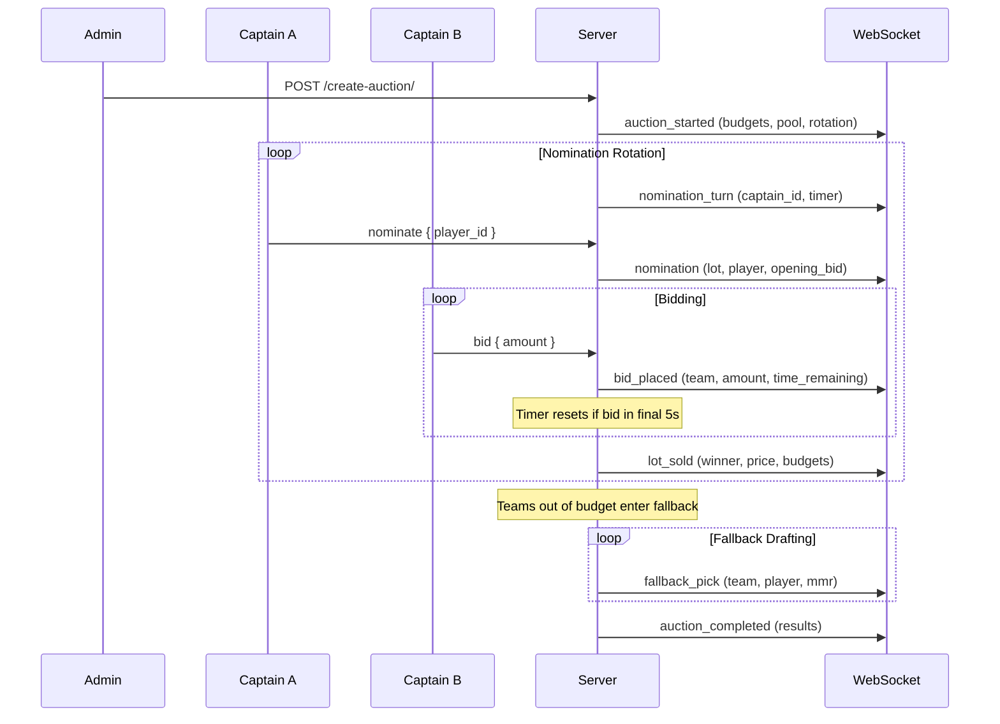
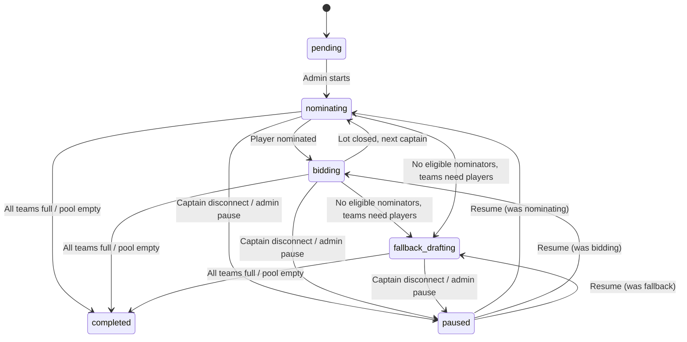

# Auction House

Alternative team formation method where captains bid on players using a virtual salary cap budget, with nomination rotation and real-time WebSocket bidding.

## Overview

The Auction House replaces or supplements the existing snake/normal/shuffle draft modes. Instead of taking turns picking players for free, captains receive a budget and bid against each other for players. This creates strategic depth — do you spend big on a star player or spread your budget across the roster?

Works at both tournament level (alongside other draft styles) and season level (forming SeasonTeams).

---

## Features

### Nomination Rotation

Captains take turns nominating a player from the available pool:

- Rotation order set by admin (or randomized) when auction is created
- Nominating captain has `nomination_timer` seconds (default 30s) to pick a player
- Timer expires → system auto-nominates the highest-MMR available player
- Nomination sets opening bid at `min_bid` with nominator as initial bidder
- Full teams are skipped in rotation

### Real-Time Bidding

Once a player is nominated, all eligible captains can bid:

- Bids must exceed current highest by at least `min_bid` (default 1)
- Each bid resets countdown if placed in the final `bid_extension_timer` seconds (default 5s)
- Prevents last-second sniping while keeping pace fast
- Timer expires with no new bids → lot closes, player assigned to winning team
- Budget deducted from winning team immediately

### Salary Cap Budget

Each team starts with a configurable budget (default 1000):

- Every winning bid deducts from the team's remaining budget
- Bids exceeding remaining budget are rejected
- Budget must reserve `min_bid * remaining_roster_slots` to ensure the team can fill its roster
- Real-time budget display for all participants

### Shuffle Draft Fallback

When a team's budget runs out but they still need players:

- Teams with no budget transition to shuffle draft picks
- Lowest team MMR picks first (existing shuffle logic with 1d6 tie-breaking)
- Fallback picks cost 0
- Configurable: `fallback_mode` can be `shuffle` (default) or `skip`

### Captain Disconnect Handling

Reuses HeroDraft's heartbeat/connected tracking pattern:

- Captain disconnects → auction auto-pauses, waits up to `reconnect_timeout` seconds (default 120s)
- Captain reconnects → auction resumes, disconnect counted against their pause budget
- `max_pauses_per_captain` configurable (default: unlimited)
- Captain exceeds pause budget → auction continues without them (turns skipped, can't bid until reconnect)
- Admin manual pauses are separate and don't count against captain budgets

---

## AuctionConfig (Cascading)

Configuration inherits down the hierarchy with each level overriding its parent. Only non-null fields override; null means "inherit from parent."

```
Organization → League → Season → Tournament → System Defaults
```

| Field | Type | Default | Description |
|-------|------|---------|-------------|
| `budget` | int | 1000 | Starting salary cap per team |
| `min_bid` | int | 1 | Minimum opening bid / bid increment |
| `bid_timer` | int | 15 | Initial seconds for bidding window after nomination |
| `bid_extension_timer` | int | 5 | Timer resets to this if bid lands in final N seconds |
| `nomination_timer` | int | 30 | Seconds to nominate before auto-pick |
| `unsold_behavior` | enum | `auto_assign` | `auto_assign` (nominator gets at min_bid) or `return_to_pool` |
| `max_roster_size` | int | 5 | Team size (captain + picked members) |
| `fallback_mode` | enum | `shuffle` | `shuffle` or `skip` when budget runs out |
| `max_pauses_per_captain` | int/null | null | Max disconnect pauses per captain (null = unlimited) |
| `reconnect_timeout` | int | 120 | Seconds to wait for captain reconnect |

Stored as a JSONField on each entity model (Organization, League, Season, Tournament). A `get_resolved_auction_config()` helper merges all layers.

### Resolution Example

- Organization sets: `budget: 2000`, `bid_timer: 20`
- League sets: `min_bid: 5`
- Tournament sets: `max_roster_size: 6`
- **Resolved:** budget=2000, min_bid=5, bid_timer=20, bid_extension_timer=5, nomination_timer=30, unsold_behavior=auto_assign, max_roster_size=6, fallback_mode=shuffle, max_pauses_per_captain=null, reconnect_timeout=120

---

## Architecture

### Data Model

#### Auction

| Field | Type | Description |
|-------|------|-------------|
| `tournament` | FK (nullable) | Tournament link |
| `season` | FK (nullable) | Season link (alternative scope) |
| `status` | enum | `pending` / `nominating` / `bidding` / `paused` / `fallback_drafting` / `completed` |
| `nomination_order` | JSONField | Ordered list of team IDs for rotation |
| `current_nominator_index` | int | Position in rotation |
| `created_at` / `updated_at` | datetime | Timestamps |

Constraint: Exactly one of `tournament` or `season` must be set.

#### AuctionTeamBudget

| Field | Type | Description |
|-------|------|-------------|
| `auction` | FK | Parent auction |
| `team` | FK | Team |
| `budget_remaining` | int | Current budget |
| `players_won` | int | Players won via bidding |
| `pause_count` | int | Disconnect pauses used |

Constraint: unique_together (auction, team).

#### AuctionLot

| Field | Type | Description |
|-------|------|-------------|
| `auction` | FK | Parent auction |
| `player` | FK (User) | Nominated player |
| `nominator` | FK (Team) | Who nominated |
| `lot_number` | int | Sequence order |
| `status` | enum | `bidding` / `sold` / `unsold` |
| `winning_team` | FK (nullable) | Who won |
| `winning_bid` | int (nullable) | Final price |
| `started_at` / `ended_at` | datetime | Bid window timing |

#### AuctionBid

| Field | Type | Description |
|-------|------|-------------|
| `lot` | FK | Parent lot |
| `team` | FK | Bidding team |
| `amount` | int | Bid amount |
| `created_at` | datetime | Timestamp |

### Flow



### State Machine



---

## API Endpoints

### REST

| Method | Endpoint | Description | Auth |
|--------|----------|-------------|------|
| POST | `/api/tournaments/{id}/create-auction/` | Create auction for tournament | Org Staff |
| POST | `/api/seasons/{id}/create-auction/` | Create auction for season | League Admin |
| GET | `/api/auctions/{id}/` | Get auction state | No |
| POST | `/api/auctions/{id}/pause/` | Admin pause auction | Org Staff |
| POST | `/api/auctions/{id}/resume/` | Admin resume auction | Org Staff |
| POST | `/api/auctions/{id}/abort/` | Abort auction | Org Staff |
| GET | `/api/auctions/{id}/results/` | Final results and spending breakdown | No |

### AuctionConfig (per-entity)

| Method | Endpoint | Description | Auth |
|--------|----------|-------------|------|
| GET | `/api/organizations/{id}/auction-config/` | Get org-level config | No |
| PUT | `/api/organizations/{id}/auction-config/` | Set org-level config | Org Admin |
| GET | `/api/leagues/{id}/auction-config/` | Get league-level config | No |
| PUT | `/api/leagues/{id}/auction-config/` | Set league-level config | League Admin |
| GET | `/api/seasons/{id}/auction-config/` | Get season-level config | No |
| PUT | `/api/seasons/{id}/auction-config/` | Set season-level config | League Admin |
| GET | `/api/tournaments/{id}/auction-config/` | Get tournament-level config | No |
| PUT | `/api/tournaments/{id}/auction-config/` | Set tournament-level config | Org Staff |
| GET | `/api/tournaments/{id}/auction-config/resolved/` | Get fully merged config | No |

**AuctionConfig Request/Response:**

```json
{
  "budget": 2000,
  "min_bid": 5,
  "bid_timer": null,
  "bid_extension_timer": null,
  "nomination_timer": null,
  "unsold_behavior": null,
  "max_roster_size": null,
  "fallback_mode": null,
  "max_pauses_per_captain": null,
  "reconnect_timeout": null
}
```

Null fields inherit from parent. The `/resolved/` endpoint returns all fields with concrete values after merging.

**Auction Results Response:**

```json
{
  "auction_id": 1,
  "status": "completed",
  "teams": [
    {
      "team_id": 1,
      "team_name": "Team Phoenix",
      "budget_start": 2000,
      "budget_spent": 1847,
      "budget_remaining": 153,
      "players": [
        { "user": { "pk": 10, "username": "star_player" }, "cost": 800, "lot_number": 3 },
        { "user": { "pk": 15, "username": "support_main" }, "cost": 450, "lot_number": 7 },
        { "user": { "pk": 22, "username": "offlaner" }, "cost": 597, "lot_number": 12 },
        { "user": { "pk": 30, "username": "pos4" }, "cost": 0, "lot_number": null, "fallback": true }
      ]
    }
  ],
  "lots": [
    {
      "lot_number": 1,
      "player": { "pk": 5, "username": "mid_player" },
      "nominator": "Team Dragon",
      "winning_team": "Team Dragon",
      "winning_bid": 650,
      "bid_count": 8
    }
  ]
}
```

### WebSocket

**Endpoint:** `/api/auction/{auction_id}/`

Same Daphne protocol routing pattern as HeroDraft.

**Client Messages:**

| Message | Payload | Description |
|---------|---------|-------------|
| `start` | — | Admin triggers auction start |
| `nominate` | `{ player_id: int }` | Captain nominates a player |
| `bid` | `{ amount: int }` | Place bid on current lot |

**Server Broadcast Events:**

| Event | Payload |
|-------|---------|
| `auction_started` | Auction state, team budgets, player pool |
| `nomination_turn` | Captain ID, timer countdown |
| `nomination` | Lot details, nominator, player, opening bid |
| `bid_placed` | Lot ID, team, amount, time remaining |
| `lot_sold` | Lot ID, winning team, price, updated budgets |
| `lot_unsold` | Lot ID, auto-assigned to nominator at min_bid |
| `fallback_pick` | Team, player picked, team MMR |
| `captain_disconnected` | Team ID, pause_count, waiting for reconnect |
| `captain_reconnected` | Team ID |
| `auction_paused` / `auction_resumed` | Timestamp, reason (admin/disconnect) |
| `auction_completed` | Final results summary |

---

## Bid Timer Behavior

The two-tier timer system prevents sniping while keeping the auction moving:

1. Lot opens after nomination → `bid_timer` countdown starts (default 15s)
2. Bid placed with > `bid_extension_timer` remaining → no timer change
3. Bid placed with <= `bid_extension_timer` remaining → timer resets to `bid_extension_timer` (default 5s)
4. No bid for full countdown → lot closes

**Example:** Lot opens → 15s. Bid at 8s left → no reset. Bid at 3s left → resets to 5s. Bid at 2s of new window → resets to 5s. Silence for 5s → sold.

---

## Edge Cases

| Scenario | Behavior |
|----------|----------|
| Captain disconnects during nomination | Auto-pause, wait `reconnect_timeout`. If timeout or pauses exhausted, skip turn. |
| Captain disconnects during bidding | Auto-pause, wait. Existing bids preserved. |
| All captains disconnect | Auction pauses until any captain reconnects. |
| Bid exceeds remaining budget | Rejected. Client disables bids above budget. |
| Budget can't cover remaining roster | Reserve `min_bid * remaining_slots`. Max bid = `budget - reserve`. |
| Nominator is only bidder | Wins at min_bid (auto_assign behavior). |
| Team roster full | Removed from rotation, can't nominate or bid. |
| Captain exceeds pause budget | Auction continues without them. Reconnect restores participation. |
| Admin aborts mid-auction | Assigned players stay. Remaining pool unassigned. |
| Concurrent auctions | Not supported — one active per tournament/season. |
| Two bids at same timestamp | First processed by server wins (serial WebSocket). |

---

## Design Decisions

| Decision | Rationale |
|----------|-----------|
| Cascading JSONField config | Simple merge, no extra joins, null = inherit from parent |
| Nomination rotation over open market | Adds strategic depth, prevents chaotic simultaneous bidding |
| Auto-nominate on timeout | Keeps auction moving, prevents griefing/stalling |
| Bid extension timer | Prevents last-second sniping, standard auction pattern |
| Budget reserve check | Ensures teams can always fill roster at minimum prices |
| Shuffle fallback for broke teams | Reuses existing shuffle draft code, natural MMR balancing |
| Heartbeat-based disconnect handling | Reuses HeroDraft pattern, configurable pause limits per captain |
| WebSocket architecture | Consistent with HeroDraft — same Daphne routing, consumer pattern, frontend store approach |
| One active auction per entity | Simplifies state management, prevents conflicts |

**Status:** :material-pencil: Design Complete
