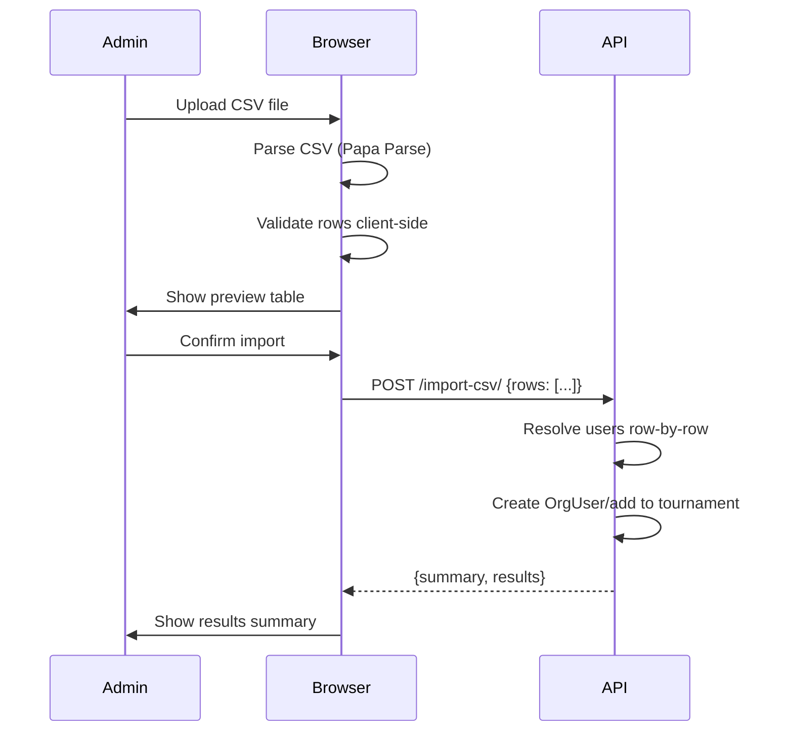

# CSV Import

Bulk-add users to organizations and tournaments via CSV file upload, with client-side preview, conflict detection, and optional team assignment.

## Overview

Admins can upload a CSV file containing Steam Friend IDs or Discord IDs to bulk-import users into an organization or tournament. The file is parsed client-side for instant preview and validation, then sent as a JSON payload to the backend for row-by-row processing with per-row error reporting.

---

## Features

### Client-Side CSV Parsing

CSV files are parsed in the browser using Papa Parse for instant feedback:

- Drag-and-drop or file picker upload
- Header auto-detection and normalization
- Row-by-row validation before submission
- Preview table showing valid/error rows with status indicators
- No server round-trip until the admin confirms import

### User Resolution

Each CSV row is resolved to a user by Steam Friend ID or Discord ID:

| Lookup Priority | Behavior |
|-----------------|----------|
| Steam ID match found | Use existing user |
| Discord ID match found | Use existing user |
| Both provided, both match same user | Use that user |
| Both provided, match different users | Use Steam match, report warning |
| No match found | Create stub user with provided IDs |

Stub users are created with a generated username (`steam_{id}` or `discord_{id}`) and can be claimed later when the real user logs in via Discord OAuth.

### Conflict Detection

When a CSV row provides both a Steam ID and Discord ID, the system checks whether the existing user's linked accounts match:

- **Steam user has different Discord ID**: Warning reported, user still added
- **Discord user has different Steam ID**: Warning reported, user still added
- **Steam and Discord resolve to different users**: Warning reported, Steam match used

Conflicts appear in the import results with details for admin review.

### Organization Import

Adds users to an organization's member list (OrgUser):

- Resolves or creates users from CSV identifiers
- Creates OrgUser records with optional `base_mmr`
- Skips users already in the organization (does not overwrite MMR)
- Logs each addition via OrgLog audit trail

### Tournament Import

Adds users to a tournament's player pool with optional team assignment:

- Everything from org import, plus:
- Creates OrgUser in the tournament's parent organization if not already a member
- Adds users to `tournament.users` M2M
- Optional `team_name` column creates/assigns teams automatically
- Multiple rows with the same `team_name` are grouped into the same team

---

## CSV Format

### Required Columns

At least one identifier column must be present:

| Column | Type | Required | Description |
|--------|------|----------|-------------|
| `steam_friend_id` | Integer | One of these | Steam 64-bit Friend ID |
| `discord_id` | Integer | required | Discord user ID |

### Optional Columns

| Column | Type | Description |
|--------|------|-------------|
| `base_mmr` | Integer | MMR to assign (defaults to 0) |
| `team_name` | String | Team assignment (tournament import only) |

### Example CSV

```csv
steam_friend_id,discord_id,base_mmr,team_name
76561198012345678,,5000,Team Phoenix
76561198098765432,123456789012345678,4500,Team Phoenix
,987654321098765432,3000,Team Dragon
76561198055555555,,4200,Team Dragon
,111222333444555666,3800,
```

Headers are case-insensitive and whitespace-trimmed.

---

## Architecture

### Flow



### Processing Model

- **Not atomic**: Each row is processed independently. If row 3 fails, rows 1-2 are still committed and rows 4+ continue processing.
- **Per-row error reporting**: Every row gets a status (`added`, `skipped`, `error`) with optional `reason` and `warning` fields.
- **Row limit**: Maximum 500 rows per import to prevent timeout.

### Tech Stack

| Component | Technology |
|-----------|------------|
| CSV parsing | Papa Parse (client-side) |
| Validation | Client: TypeScript validation, Server: Django view |
| UI | Shadcn Dialog, drag-and-drop upload |
| API | Django REST Framework |

---

## API Endpoints

### Organization CSV Import

| Method | Endpoint | Description | Auth |
|--------|----------|-------------|------|
| POST | `/api/organizations/{id}/import-csv/` | Bulk-import users to org | Org Staff |

**Request Body:**

```json
{
  "rows": [
    {
      "steam_friend_id": "76561198012345678",
      "discord_id": "123456789012345678",
      "base_mmr": 5000
    }
  ]
}
```

**Response:**

```json
{
  "summary": {
    "added": 2,
    "skipped": 1,
    "created": 1,
    "errors": 0
  },
  "results": [
    {
      "row": 1,
      "status": "added",
      "user": { "pk": 10, "username": "player1", "avatar": "..." },
      "created": false
    },
    {
      "row": 2,
      "status": "added",
      "user": { "pk": 50, "username": "steam_76561198099999999" },
      "created": true,
      "warning": "Steam ID 76561198099999999 is already linked to Discord ID 999... — provided Discord ID 111... was ignored"
    },
    {
      "row": 3,
      "status": "skipped",
      "reason": "Already a member",
      "user": { "pk": 5, "username": "existing_member" }
    }
  ]
}
```

**Summary Fields:**

| Field | Description |
|-------|-------------|
| `added` | Users successfully added to the organization |
| `skipped` | Users already in the organization |
| `created` | New stub users created (subset of `added`) |
| `errors` | Rows that failed to process |

### Tournament CSV Import

| Method | Endpoint | Description | Auth |
|--------|----------|-------------|------|
| POST | `/api/tournaments/{id}/import-csv/` | Bulk-import users to tournament | Org Staff |

Same request/response format as organization import, with additional fields:

**Additional Request Fields:**

| Field | Type | Description |
|-------|------|-------------|
| `team_name` | string | Optional team assignment |

**Additional Response Fields:**

| Field | Description |
|-------|-------------|
| `team` | Team name the user was assigned to (if provided) |

**Behavior:**

- Creates OrgUser in the tournament's parent organization if needed
- Adds user to `tournament.users` M2M
- Creates Team by name if `team_name` provided and team doesn't exist
- Groups multiple rows with same `team_name` into the same team
- First member of a new team becomes the captain (no captain assigned by default)

### Error Responses

| Status | Condition |
|--------|-----------|
| 400 | `rows` is not a list, or exceeds 500 row limit |
| 403 | User lacks org staff access |
| 404 | Organization or tournament not found |

---

## UI Components

### CSVImportModal

Three-step modal dialog:

**Step 1 — Upload**: Drag-and-drop zone or file picker. Accepts `.csv` files only.

**Step 2 — Preview**: Table showing parsed rows with validation status:

- Green checkmark for valid rows
- Red X for error rows with error message
- Column headers: #, Status, Steam ID, Discord ID, MMR, Team (tournament only)
- Summary counts: "X valid, Y errors"
- "Choose different file" button to restart
- "Import N rows" confirm button (disabled if 0 valid rows)

**Step 3 — Results**: Summary cards showing added/created/skipped/error counts, with a detail table for rows that had warnings or errors.

### Integration Points

The CSVImportModal is wired into:

- **Organization page** (Users tab): "Import CSV" button next to "Add Member"
- **Tournament page** (Players tab): "Import CSV" button next to "Add Player"

Both use the same `CSVImportModal` component with different `entityContext` props.

---

## Design Decisions

| Decision | Rationale |
|----------|-----------|
| Client-side parsing | Instant preview without server round-trip; reduces backend load |
| JSON payload (not raw CSV) | Backend receives pre-parsed, validated data; simpler endpoint |
| Row-by-row processing (not atomic) | Partial success is better than all-or-nothing for large imports |
| Stub user creation | Allows importing rosters before players have logged in |
| Steam ID priority over Discord | Steam ID is the primary game identity for Dota 2 |
| 500 row limit | Prevents request timeout; covers most community league sizes |
| No MMR overwrite on skip | Prevents accidental data loss; admin must update MMR manually |

---

## Edge Cases

| Scenario | Behavior |
|----------|----------|
| Duplicate rows in same CSV | Both processed; second row skipped as "Already a member" |
| Empty CSV file | Error shown in upload step |
| CSV with only unknown columns | Validation error: no identifier column found |
| Non-numeric Steam/Discord ID | Row marked as error in preview |
| Very long team names | Accepted (CharField limit applies) |
| Tournament without parent org | OrgUser creation skipped; user added to tournament only |
| Concurrent imports | Each row uses savepoint transactions; race conditions handled via retry |

**Status:** :material-pencil: Design Complete | [GitHub #132](https://github.com/kettleofketchup/DraftForge/issues/132)
