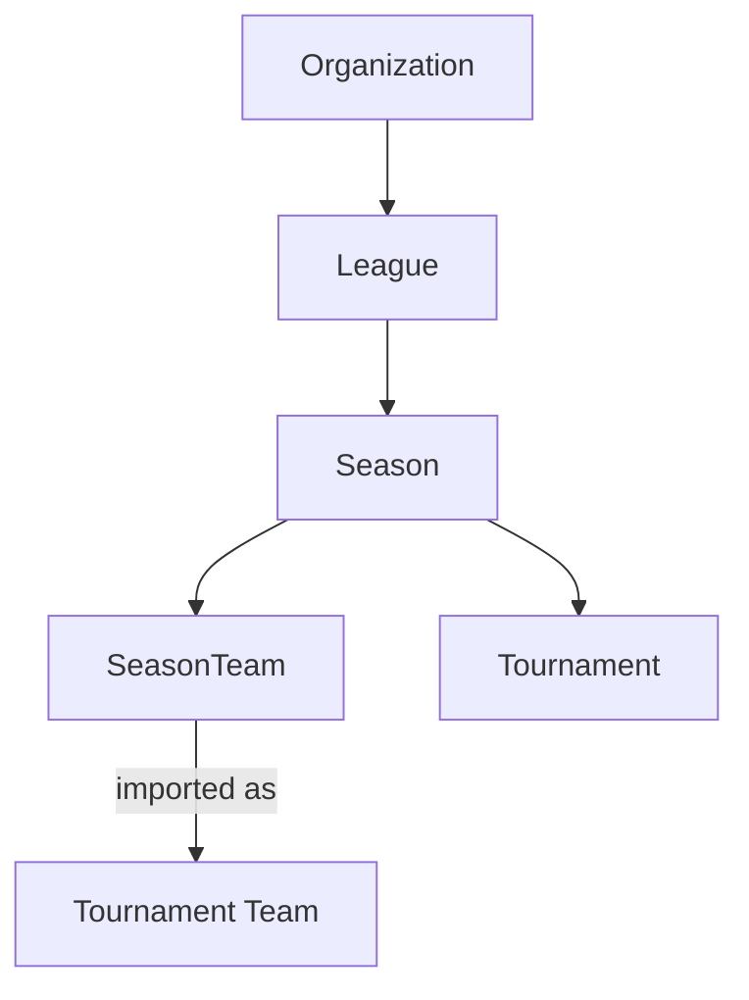
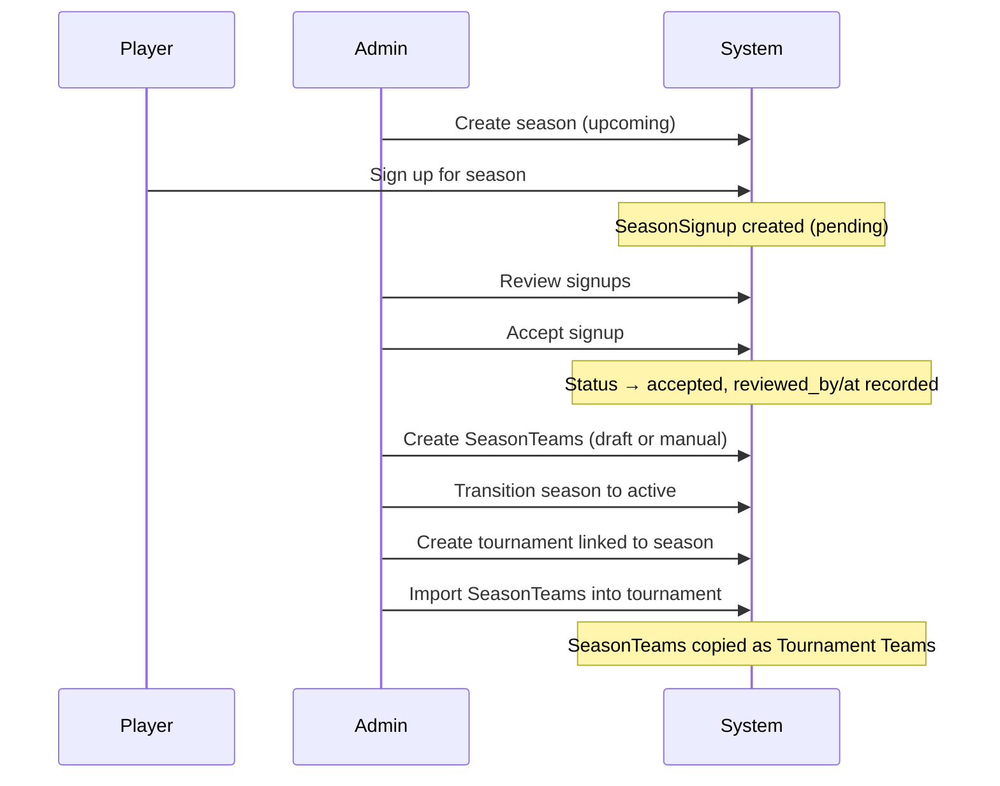

# Team Management & Seasons

Persistent team management within leagues, organized by seasons. Teams are formed per-season via draft or manual creation, then imported into tournaments.

## Overview

Currently, teams exist only within individual tournaments and are created during the draft process. This feature introduces **Seasons** as a container for teams within a league, allowing rosters to persist across multiple tournaments (group stages, playoffs, brackets) within a season.

---

## Core Concepts

### Hierarchy

### Season

A time-bounded chapter within a league. Contains a player pool (via signups) and teams.

| Field | Type | Description |
|-------|------|-------------|
| `league` | FK → League | Parent league |
| `name` | CharField | e.g., "Season 3" |
| `number` | IntegerField | Sequential (1, 2, 3...) |
| `status` | ChoiceField | `upcoming`, `active`, `completed` |
| `start_date` | DateTimeField | Season start |
| `end_date` | DateTimeField | Season end (nullable for open-ended) |
| `signup_deadline` | DateTimeField | When signups close (nullable) |
| `timezone` | CharField | Display timezone (consistent with League) |
| `created_at` | DateTimeField | Auto |
| `updated_at` | DateTimeField | Auto |

**Constraints:**

- `(league, number)` unique — no duplicate season numbers
- One `active` season per league at a time

**Status transitions:**

- `upcoming` → `active` → `completed`
- No backward transitions

### Season Signup

Players express interest in joining a season through their LeagueUser identity.

| Field | Type | Description |
|-------|------|-------------|
| `season` | FK → Season | Which season |
| `league_user` | FK → LeagueUser | Who signed up |
| `status` | ChoiceField | `pending`, `accepted`, `rejected` |
| `note` | TextField | Optional message from player |
| `signed_up_at` | DateTimeField | Auto |
| `reviewed_by` | FK → CustomUser | Admin who reviewed (nullable) |
| `reviewed_at` | DateTimeField | When reviewed (nullable) |

**Constraints:**

- `(season, league_user)` conditional unique for `pending`/`accepted` — prevents duplicate active signups while allowing re-signup after rejection

**Season members** are derived from accepted signups — no separate M2M. Query: `SeasonSignup.objects.filter(season=season, status='accepted')`.

### Season Team

Teams that belong to a season. Rosters persist across all tournaments within the season.

| Field | Type | Description |
|-------|------|-------------|
| `season` | FK → Season | Parent season |
| `name` | CharField | Team name |
| `captain` | FK → LeagueUser | Captain (nullable — can assign later) |
| `deputy_captain` | FK → LeagueUser | Deputy captain (nullable) |
| `members` | M2M → LeagueUser | Roster |
| `logo` | ImageField | Team logo (nullable) |
| `created_at` | DateTimeField | Auto |
| `updated_at` | DateTimeField | Auto |

**Constraints:**

- `(season, name)` unique
- A LeagueUser can only be on one SeasonTeam per season (enforced via validation)

### Tournament ↔ Season

The existing Tournament model gains:

| Field | Type | Description |
|-------|------|-------------|
| `season` | FK → Season | Optional season link (`on_delete=SET_NULL`, nullable) |

And the existing Team model gains:

| Field | Type | Description |
|-------|------|-------------|
| `season_team_source` | FK → SeasonTeam | Provenance tracking (`on_delete=SET_NULL`, nullable) |

Tournaments without a season work exactly as today. When linked to a season, an admin can **import SeasonTeams** as tournament teams. Import creates independent copies — changes to the SeasonTeam after import do not propagate.

---

## Signup Flow

---

## Team Formation

Seasons support two methods for forming teams:

### Draft-Based

Run a player draft at the season level. Captains are selected from the accepted signup pool, then draft from remaining members. Uses the existing draft system (snake, normal, shuffle).

### Manual Creation

Admins create SeasonTeams directly and assign members from the accepted signup pool. Useful for invite-only leagues or pre-formed teams.

---

## Tournament Import

When a tournament is linked to a season, the admin can import teams:

1. `POST /api/tournaments/{id}/import-season-teams/` copies SeasonTeams into Tournament Teams
2. Captain, deputy captain, members, name, and logo are copied
3. LeagueUser references are resolved to CustomUser for the Tournament Team model
4. After import, tournament teams are fully independent
5. Supports re-import if the tournament has not started (deletes and recreates)
6. Supports partial import (specific SeasonTeam IDs)

---

## Data Location

New models live in the `league` app (alongside `LeagueUser`), not in the already-large `app/models.py`:

- `league/models.py` — Season, SeasonSignup, SeasonTeam
- `app/models.py` — Tournament gains `season` FK, Team gains `season_team_source` FK

---

## Edge Cases

| Scenario | Behavior |
|----------|----------|
| Member removed from season while on a SeasonTeam | Remove from SeasonTeam members. Block removal if they are captain (must reassign first). |
| SeasonTeam modified after tournament import | No effect — tournament teams are independent copies. |
| Season deleted | Tournament.season set to NULL (SET_NULL). Tournament continues working. |
| LeagueUser leaves league | SeasonSignup cascade-deleted. SeasonTeam.captain set to NULL. M2M membership auto-removed. |
| Two active seasons in same league | Prevented by database constraint. |
| Signup after deadline | Rejected at API level if `signup_deadline` has passed. |

---

## Design Decisions

| Decision | Rationale |
|----------|-----------|
| SeasonTeam separate from Team | SeasonTeams are roster templates; Tournament Teams have tournament-specific fields (placement, points, draft_order, drop-ins). |
| Copy semantics on import | Competitive integrity — mid-tournament roster changes should not propagate from season. |
| Members derived from accepted signups | Single source of truth, no M2M sync issues. |
| LeagueUser as participation identity | Keeps MMR context, enforces league membership, consistent with existing `Team.league_users`. |
| ImageField for logo | Future-proofs for file uploads; existing URLField on Organization will migrate to ImageField. |
| Models in league app | Keeps app/models.py manageable; follows existing OrgUser/LeagueUser pattern. |

---

## Problems and Solutions

| Problem | Solution |
|---------|----------|
| Teams disappear between tournaments | Seasons persist teams across tournaments |
| No signup workflow for seasons | SeasonSignup with pending/accepted/rejected flow |
| Roster changes mid-tournament | Import creates independent copies |
| No team branding | ImageField logo on SeasonTeam |
| Duplicate signups | Conditional unique constraint |
| Stale season status | One-active-per-league constraint + enforced transitions |

**Status:** :material-pencil: Design Complete
